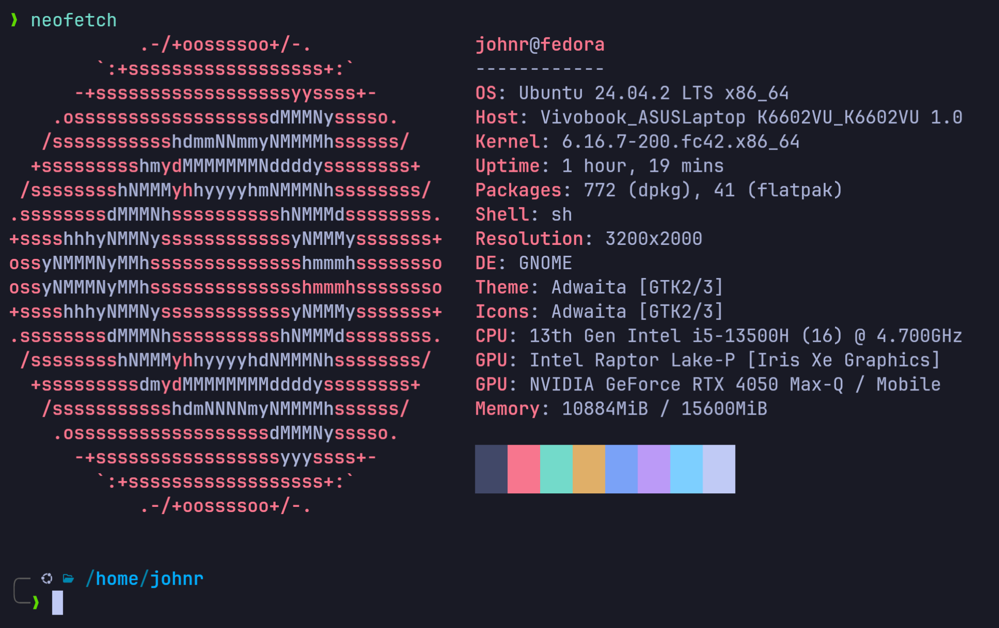
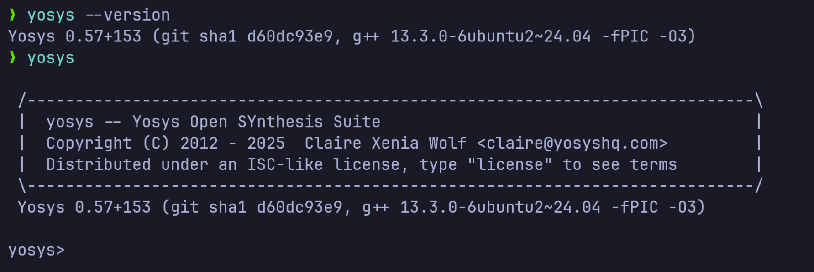
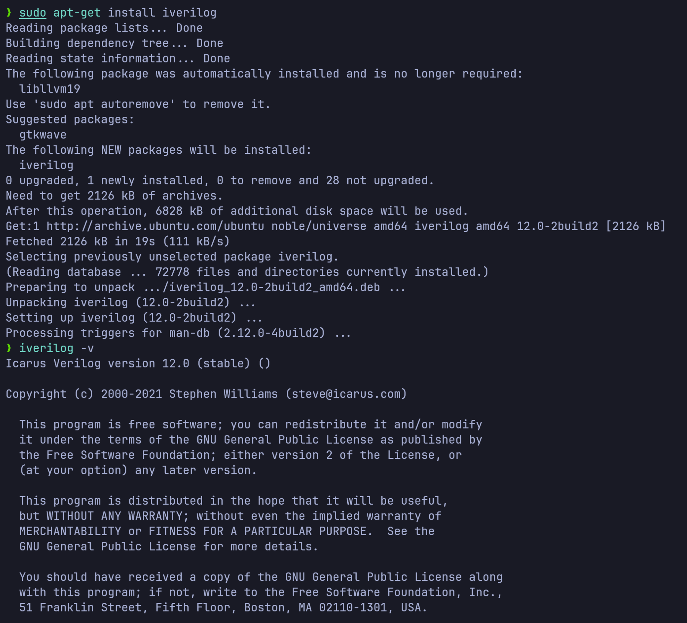
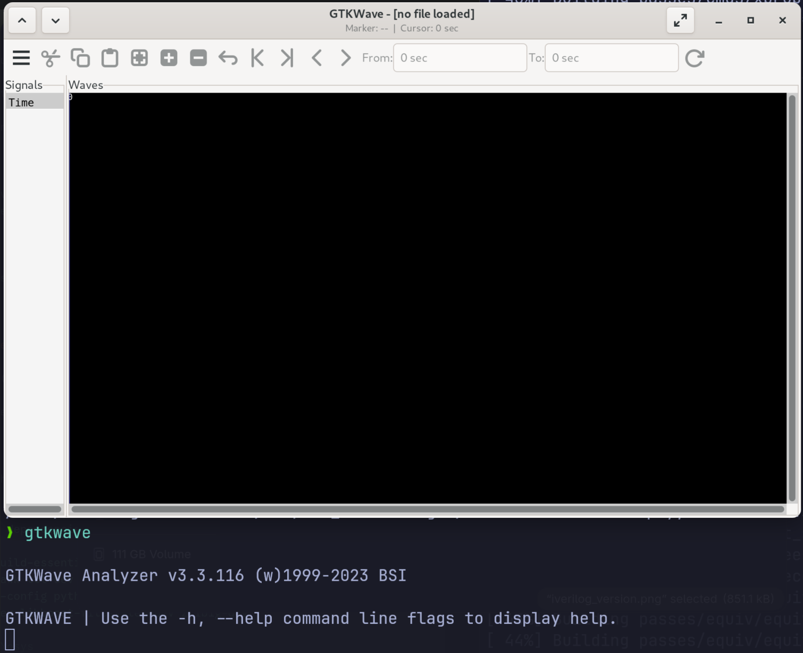

# My RISC-V Tapeout Program Journey 🚀

This repository documents my progress, learnings, and submissions for the RISC-V Tapeout Program.

---

## My Progress Log

<details>
<summary><h3>Day 0: Tools Installation on Fedora using Distrobox</h3></summary>

As a Fedora user, I'm using a Distrobox container with an Ubuntu image to ensure compatibility with the required toolchain.

#### 1. Setup the Ubuntu Container

First, I created and entered an Ubuntu container named `DevBox`.

```bash
# Create the container with a home directory in ~/Devel
distrobox create -n DevBox \
  --image ghcr.io/ublue-os/ubuntu-toolbox \
  --init \
  --home $HOME/Devel

# Enter the container shell
distrobox enter DevBox
```



#### 2. Install Yosys (Synthesis Tool)

Yosys is an open-source framework for Verilog RTL synthesis.

```bash
# Clone the repository
git clone [https://github.com/YosysHQ/yosys.git](https://github.com/YosysHQ/yosys.git)
cd yosys

# Install all required dependencies
sudo apt-get update
sudo apt-get install build-essential clang bison flex \
     libreadline-dev gawk tcl-dev libffi-dev git \
     graphviz xdot pkg-config python3 libboost-system-dev \
     libboost-python-dev libboost-filesystem-dev zlib1g-dev

# Compile and install Yosys
make
sudo make install
```



#### 3. Install Icarus Verilog (Simulation Tool)

Icarus Verilog (`iverilog`) is used for simulating the Verilog designs.

```bash
sudo apt-get install iverilog
```


#### 4. Install GTKWave (Waveform Viewer)

GTKWave is used to visualize the simulation output (`.vcd` files).

```bash
sudo apt-get install gtkwave
```



</details>

---
