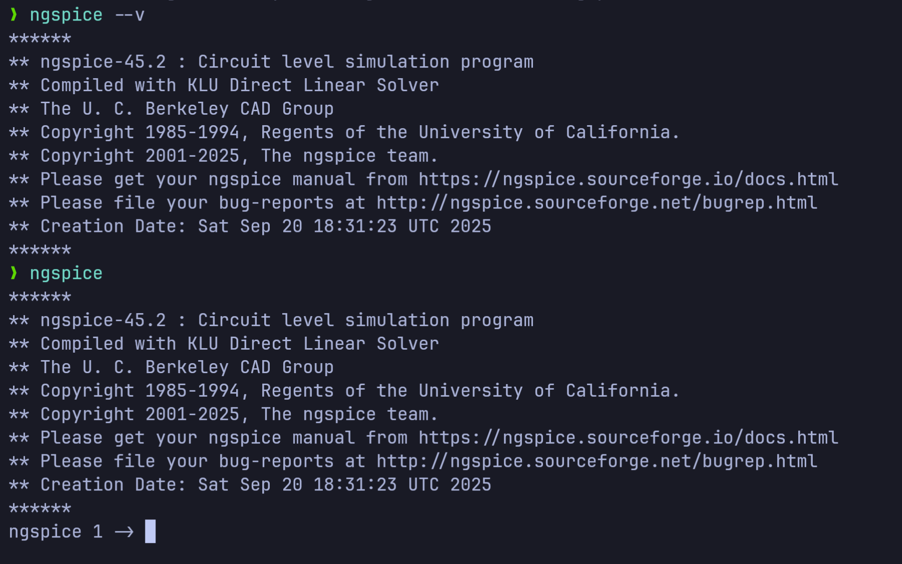
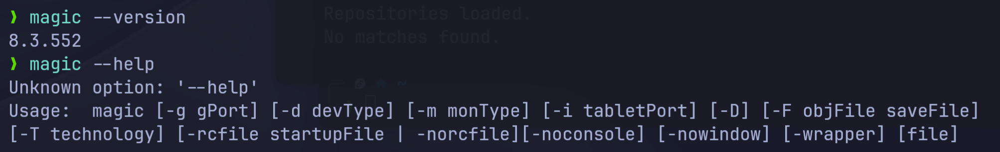
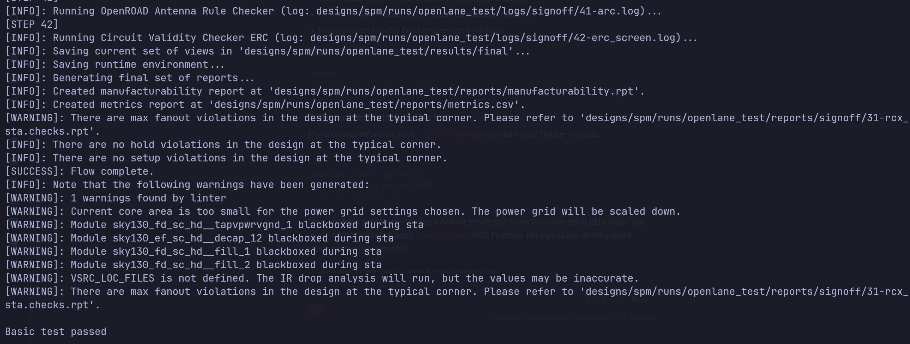

# My RISC-V Tapeout Program Journey 🚀

This repository documents my progress, learnings, and submissions for the RISC-V Tapeout Program.

---

## My Progress Log

<details>
<summary><h3>Day 0: Tools Installation</h3></summary>

As a Fedora user, I'm using a Distrobox container with an Ubuntu image to ensure compatibility with the required toolchain. This documents the installation of all required EDA tools.

#### 1. Setup the Ubuntu Container

First, I created and entered an Ubuntu container named `DevBox`.

```bash
# Create the container with a home directory in ~/Devel
distrobox create -n DevBox \
  --image ghcr.io/ublue-os/ubuntu-toolbox \
  --init \
  --home $HOME/Devel

# Enter the container shell
distrobox enter DevBox
```


#### 2. Yosys (Synthesis Tool)
Yosys is an open-source framework for Verilog RTL synthesis.

```bash
# Clone the repository
git clone [https://github.com/YosysHQ/yosys.git](https://github.com/YosysHQ/yosys.git)
cd yosys

# Install all required dependencies
sudo apt-get update
sudo apt-get install build-essential clang bison flex \
     libreadline-dev gawk tcl-dev libffi-dev git \
     graphviz xdot pkg-config python3 libboost-system-dev \
     libboost-python-dev libboost-filesystem-dev zlib1g-dev

# Compile and install Yosys
make
sudo make install
```


#### 3. Icarus Verilog (Simulation Tool)
Icarus Verilog (`iverilog`) is used for simulating the Verilog designs.

```bash
sudo apt-get install iverilog
```


#### 4. GTKWave (Waveform Viewer)
GTKWave is used to visualize the simulation output (`.vcd` files).

```bash
sudo apt-get install gtkwave
```


#### 5. ngspice (Circuit Simulator)
ngspice is an open-source spice simulator for circuit simulation.

```bash
# Download the tarball from [https://sourceforge.net/projects/ngspice/files/](https://sourceforge.net/projects/ngspice/files/)
# Assuming ngspice-37.tar.gz is in the current directory
tar -zxvf ngspice-*.tar.gz
cd ngspice-*
mkdir release
cd release
../configure --with-x --with-readline=yes --disable-debug
make
sudo make install
```


#### 6. Magic (VLSI Layout Tool)
Magic is a venerable VLSI layout tool.

```bash
# Install dependencies for Magic
sudo apt-get install m4 tcsh csh libx11-dev tcl-dev tk-dev \
     libcairo2-dev mesa-common-dev libglu1-mesa-dev libncurses-dev

# Clone, configure, and install
git clone [https://github.com/RTimothyEdwards/magic.git](https://github.com/RTimothyEdwards/magic.git)
cd magic
./configure
make
sudo make install
```


#### 7. OpenLane (RTL to GDSII Flow)
OpenLane is an automated RTL to GDSII flow based on several open-source EDA tools.

```bash
# Install Docker
sudo apt-get update
sudo apt install -y build-essential python3 python3-venv python3-pip make git
sudo apt install -y apt-transport-https ca-certificates curl software-properties-common
curl -fsSL [https://download.docker.com/linux/ubuntu/gpg](https://download.docker.com/linux/ubuntu/gpg) | sudo gpg --dearmor -o /usr/share/keyrings/docker-archive-keyring.gpg
echo "deb [arch=amd64 signed-by=/usr/share/keyrings/docker-archive-keyring.gpg] [https://download.docker.com/linux/ubuntu](https://download.docker.com/linux/ubuntu) $(lsb_release -cs) stable" | sudo tee /etc/apt/sources.list.d/docker.list > /dev/null
sudo apt update
sudo apt install -y docker-ce docker-ce-cli containerd.io

# Add user to the docker group to run docker without sudo
sudo groupadd docker
sudo usermod -aG docker $USER

# A reboot is required after this step for the group changes to take effect.
echo "Please reboot your system now to apply Docker group changes."
```
After rebooting:
```bash
# Test Docker installation
docker run hello-world

# Clone OpenLane and build the environment
cd $HOME
git clone [https://github.com/The-OpenROAD-Project/OpenLane.git](https://github.com/The-OpenROAD-Project/OpenLane.git)
cd OpenLane
make

# Test the OpenLane installation
make test
```


</details>

---
